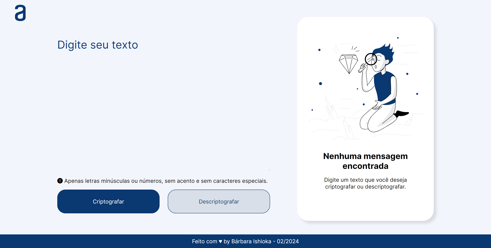

#

# Challenge - Decodificador de Texto

Criado um decodificador de texto utilizando HTML, CSS e Javascript.

- Adicionado responsividade utilizando media queries, modal personalizado, footer, efeitos hover e active;
- Automatização de estilos e tamanhos: Quando apaga o conteúdo do textarea, a section que mostra a mensagem criptografada muda para o estado inicial.
- Adicionado expressão regular seguinte: Apenas letras minúsculas ou números, sem acento e sem caracteres especiais.

[Projeto online](https://barbaraishioka.github.io/alura-one-T6/Decodificador_de_Texto)

[Trello](https://trello.com/b/EmUFmjCv/decodificador-de-texto-alura-challenges-oracle-one)

[Modelo Figma](https://www.figma.com/file/tvFEYhVfZTjdJ5P24RGV21/Alura-Challenge---Desafio-1---L%C3%B3gica?node-id=16%3A802)



## Tecnologias

- HTML
- CSS
- Javascript

## Instalação

```bash
git clone https://github.com/barbaraishioka/alura-one-T6/Decodificador_de_Texto

cd Decodificador_de_Texto

```

## Licença

Este projeto está licenciado sob os termos da Licença MIT.
