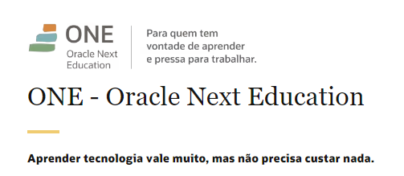

 

  <h1>Programa ONE - Alura + Oracle - T6</h1>

  

    <a href="#formacao">Formação</a>&nbsp;&nbsp;&nbsp;|&nbsp;&nbsp;&nbsp;
    <a href="#projetos">Projetos</a>&nbsp;&nbsp;&nbsp;|&nbsp;&nbsp;&nbsp;
    <a href="#cronograma">Cronograma</a>
  

  <h3>
    O Programa ONE é um programa gratuito de formação e inclusão em tecnologia do
    <b>Oracle</b> em parceria com a plataforma <b>Alura</b>.
  </h3>

  

    Saiba mais sobre o Programa ONE:
    <a href="https://www.oracle.com/br/education/oracle-next-education/"
      >https://www.oracle.com/br/education/oracle-next-education/</a
    >
  

   
   

  <h2>Formação Back-End 🚀</h2>
  <h3>💻 Stacks desenvolvidas durante o programa</h3>

   

  

      
      
      
      
      
  

   

   

  <h2>Meus projetos</h2>

  

    Esse repositório tem como objetivo documentar minha trajetória durante o
    programa ONE.
  

   

  <table>
    <thead>
      <tr>
        <th align="center">#</th>
        <th align="center">Projeto</th>
        <th align="center"></th>
      </tr>
    </thead>
    <tbody>
      <tr>
        <td>01</td>
        <td><a href="./PASTA ONDE ESTÁ O PROJETO/readme.md">Jogo do número secreto - HTML | CSS | Javascript</a></td>
        <td align="center">
          
        </td>
      </tr>                                       
    </tbody>
  </table>

   

  <h2>Cronograma 📆</h2>

  
Início: 15 de Janeiro de 2024

   

  <table>
    <thead>
      <tr>
        <th>Curso</th>
        <th>Carga Horária</th>
      </tr>
    </thead>
    <tbody>
      <tr>
        <td>Fase Seleção Turma 6 do ONE - Oracle Next Education</td>
        <td align="center">-</td>
      </tr>
      <tr>
        <td>Evento Hello ONE BR - Youtube</td>
        <td align="center">1h16m</td>
      </tr>
      <tr>
        <td>Desenvolvimento Pessoal T6 ONE - 4 Cursos</td>
        <td align="center">38h</td>
      </tr>
      <tr>
        <td>Lógica de programação: mergulhe em programação com JavaScript</td>
        <td align="center">6h</td>
      </tr>
      <tr>
        <td>Iniciante em Programação T6 ONE - 7 Cursos</td>
        <td align="center">54h</td>
      </tr>  
      <tr>
        <td>1º Challenge - Decodificador de Texto</td>
        <td align="center">-</td>
      </tr>                        
    </tbody>

  </table>

   

  
<a href="#top">⬆️ Voltar ao topo</a>

   

